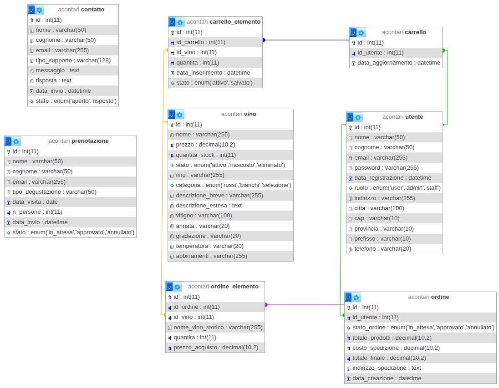

 

<h1 style="margin-bottom:0; padding-bottom:5px;">Relazione di progetto Tenuta al Morer</h1><h3 style="margin-top:0; padding-top:0; margin-bottom:10px;">Corso di Tecnologie Web A.A. 2025-26</h3>

<h3 style="margin-bottom: 0; margin-top: 15px; font-size: 1.17em; font-weight: bold;">Autori</h3>Luca Marcuzzo, matricola 2113198, luca.marcuzzo.1@studenti.unipd.it Michele Stevanin, matricola 2101741, michele.stevanin@studenti.unipd.it Giovanni Visentin, matricola 2101064, giovanni.visentin.7@studenti.unipd.it Alessandro Contarini, matricola 2101052, alessandro.contarini.1@studenti.unipd.it (referente) <h3 style="margin-bottom: 0; margin-top: 15px; font-size: 1.17em; font-weight: bold;">Sito web</h3>https://tecweb.studenti.math.unipd.it/acontari <h3 style="margin-bottom: 0; margin-top: 15px; font-size: 1.17em; font-weight: bold;">Repository GitHub</h3>https://github.com/Tenuta-al-Morer/tecweb <h3 style="margin-bottom: 0; margin-top: 15px; font-size: 1.17em; font-weight: bold;">Credenziali</h3>Utente: user@test.com / user Staff: staff@test.com / staff Admin: admin@test.com / admin

 
 

## Introduzione

La presente relazione ha come scopo quello di descrivere le metodologie e i ragionamenti che abbiamo applicato per la realizzazione del progetto per il corso di Tecnologie Web (Laurea in Informatica - L31) per l’anno accademico 2025-2026. Il progetto ha previsto la creazione di un sito web accessibile per la cantina vitivinicola Tenuta al Morer.

Il sito offre diverse funzionalità agli utenti:

- consultazione di contenuti informativi e descrittivi sulla tenuta;

- visualizzazione del catalogo dei vini disponibili;

- acquisto di prodotti enologici, previa registrazione e creazione di un account personale;

- prenotazione di esperienze di degustazione;

- gestione dell’area personale con storico ordini e prenotazioni;

- invio di richieste di assistenza o segnalazioni tramite l’apposita sezione contatti.

L’obiettivo principale è stato sviluppare un’esperienza intuitiva e completa per gli utenti, facilitando l’interazione con la cantina e l’accesso alle informazioni sui prodotti.

## Analisi dei requisiti

Prima di avviare lo sviluppo del sito, abbiamo analizzato diversi siti web di cantine già esistenti per identificare le informazioni principali da includere. A partire da questi spunti, abbiamo integrato la nostra visione e i servizi aggiuntivi che intendiamo offrire, definendo così la struttura gerarchica del sito di Tenuta al Morer.

Le pagine sono state progettate per essere semplici da usare e visivamente accattivanti, con particolare attenzione all’ottimizzazione per dispositivi mobili. In questa fase abbiamo anche stabilito convenzioni interne per garantire un’esperienza utente coerente e intuitiva.

### Analisi utente

Tenuta al Morer si presenta come un sito fruibile da chiunque sia alla ricerca di vini di qualità o di informazioni enologiche. Il sito si rivolge a un pubblico che possiede almeno conoscenze base sul mondo del vino; esso adotta un linguaggio tecnico dove necessario, ma rimane facilmente comprensibile nel complesso per accogliere l’eventuale utente che non ha le idee chiare e vuole informarsi per apprendere nuove informazioni.

Struttura e layout sono semplici per permettere all’utente di familiarizzare facilmente con la navigazione del sito. Ci aspettiamo che la maggior parte degli utenti lo utilizzi con browser piuttosto recenti e che la tendenza agli accessi tramite mobile avvenga soprattutto per attività associate alla gestione delle proprie prenotazioni e alla ricerca veloce di vini.

L’età degli utenti spazia dai 25 ai 70 anni.

### SEO

Di seguito vengono riportate le ricerche alle quali il sito vuole rispondere:

- il nome del sito ("Tenuta al Morer");

- tutte le ricerche che contengano nomi di vini presenti nel sito;

- tutte le ricerche sull’argomento delle degustazioni e visite in cantina;

- ricerche più generali come "cantina veneta", "vino", "acquisto vino online", "degustazione vini".

Le parole chiave selezionate sono state pensate per rivolgersi sia ad utenti che hanno già un’idea chiara di cosa stanno cercando, sia a nuovi utenti che cercano di capire di più durante la navigazione.

Operazioni svolte per migliorare il ranking del sito:

- il contenuto del tag title va dal particolare al generale e presenta parole chiave;

- in ogni pagina, tramite il meta tag keywords, sono state indicate le parole chiave relative alla pagina stessa;

- separazione tra struttura e presentazione;

- separazione tra struttura e comportamento;

- abbiamo limitato l’utilizzo dei display:none, visibility:hidden e abbiamo evitato completamente height:0.

## Progettazione

### Schema organizzativo

Abbiamo definito una struttura chiara per la gestione dei contenuti, organizzando le informazioni relative ai vini, alle prenotazioni e agli utenti in modo logico e interconnesso. Il sito permette di navigare facilmente tra i prodotti disponibili e le relative opzioni di acquisto.

È presente una funzione di ricerca per individuare rapidamente un vino nel catalogo. Gli utenti registrati possono acquistare vini e prenotare degustazioni, mentre l’admin ha il compito di gestire gli ordini e aggiornare il catalogo vini.

### Tipi di utente

Durante la fase di progettazione sono stati individuati i seguenti tipi di utente:

- **Ospite**: l’utente ospite ha accesso alle sezioni che non sono private del sito, come le pagine "Home", "Tenuta", "Vini", "Esperienze" e "Contatti". Può prenotare degustazioni, inviare richeiste di assistenza e ha la possibilità di inserire vini nel carrello. Tuttavia non può effettuare acquisti né accedere all’area riservata, a meno che non completi la registrazione.

- **Utente registrato**: l’utente registrato ha accesso completo alle funzionalità del sito relative agli utenti finali, come la possibilità di acquistare vini e gestire il proprio account all’interno dell’area riservata.

- **Staff**: l’utente staff può gestire le prenotazioni degli utenti, approvandole o rifiutandole. Inoltre, ha il controllo delle richieste di assistenza ricevute tramite il modulo contatti.

- **Admin**: l’utente admin può gestire tutti gli aspetti del sito, inclusi gli ordini degli utenti, le prenotazioni, i messaggi di assistenza, il catalogo vini e la gestione degli utenti registrati.

### Funzionalità

Elenco delle funzionalità del sito:

- registrazione utente;

- login utente/staff/admin;

- visualizzazione catalogo vini;

- visualizzazione dei dettagli di uno specifico vino;

- ricerca testuale dei prodotti nel catalogo;

- acquisto vini (utente registrato);

- gestione carrello della spesa;

- checkout e creazione ordini;

- prenotazione esperienze;

- invio di richieste di assistenza;

- gestione account utente (modifica dati, cambio password, eliminazione account);

- consultazione storico ordini e stato prenotazioni nell’area riservata;

- gestione ordini (staff/admin);

- gestione prenotazioni (staff/admin);

- gestione messaggi assistenza (staff/admin);

- gestione catalogo vini (admin);

- gestione utenti registrati (admin).

### Convenzioni interne

Elenco delle convenzioni interne del sito:

- i link, sia quelli visitati che quelli non visitati, si presentano sottolineati. In particolare, i link non visitati hanno colore del testo bianco e sfondo nero. I link visitati invece hanno colore del testo oro e sfondo nero. Sono stati scelti questi colori in quanto fanno parte della palette utilizzata;

- i forms si presentano con un colore di sfondo nero, testo di colore bianco ed etichette dei vari campi di input di colore grigio;

- i link circolari (ovvero quelli che rimandano alla stessa pagina visualizzata) nel menù sono disabilitati e nascosti allo screen reader, oltre ad non avere la sottolineatura. Si indica così all’utente che il link non è utilizzabile, evitando i disagi dei link circolari.

### Schema database

Le principali tabelle del database sono:

- **utente**: gestisce gli account degli utenti con i relativi ruoli

- **vino**: catalogo completo dei prodotti vinicoli

- **carrello** e **carrello_elemento**: gestione del carrello acquisti

- **ordine** e **ordine_elemento**: gestione degli ordini effettuati

- **prenotazione**: gestione delle prenotazioni esperienze

- **contatto**: gestione dei messaggi di assistenza

<figure data-latex-placement="H">

<figcaption>Schema del database Tenuta al Morer</figcaption>
</figure>

## Realizzazione

Per la realizzazione del sito abbiamo utilizzato dati relativi a vini realmente esistenti della tradizione vitivinicola veneta. Le immagini dei prodotti e della tenuta sono state generate o ottimizzate tramite strumenti di intelligenza artificiale per garantire una resa visiva coerente con il layout del sito, mantenendo comunque i riferimenti autentici al territorio e ai nomi originali dei prodotti.

Inoltre, per lo sviluppo del frontend abbiamo adottato la strategia *Desktop First*.

### Struttura e contenuto

#### HTML

Il sito è stato sviluppato in HTML5 con sintassi XML. Abbiamo cercato di mantenere più struttura possibile nei file HTML ed eventualmente andare a lavorare e sostituire alcune parti con il PHP. Per sostituire singole parole, abbiamo utilizzato come segnaposto delle parole racchiuse tra parentesi quadre (\[marca\]). Invece per sostituire intere sezioni è stato utilizzato il metodo preg_replace() di PHP, rispettando un certo pattern.

Un esempio è l’utilizzo nel file vini.html per la visualizzazione dei prodotti:

    <section id="red-wines">
        

            [vini_rossi]
        

    </section>

In questo caso, per l’inserimento e l’aggiornamento dei vini visualizzati, verrà sostituita tutta la sezione compresa all’interno del div con classe "sezione". Questo approccio ci permette di impostare una struttura fissa nei file HTML e andare a modificare in maniera dinamica il contenuto tramite PHP.

#### Popolamento database

Per il popolamento del database abbiamo scelto di procedere manualmente, poiché non era necessario generare una grande quantità di dati. I nomi dei vini sono stati scelti in modo creativo dal nostro gruppo, mentre le immagini sono state generate tramite strumenti di intelligenza artificiale.

### Presentazione

#### CSS

Uno degli aspetti più importanti del nostro CSS è l’utilizzo delle variabili, impostate all’inizio del file e riutilizzate più volte in parti differenti. In questo modo riusciamo ad uniformare e tenere sotto controllo i contrasti e i colori utilizzati. Particolare attenzione è stata posta anche all’utilizzo di layout di tipo flex e grid. In quanto pesanti da renderizzare per i browser, ne è stato fatto un uso consapevole, evitando di andare oltre il secondo livello.

Successivamente, vogliamo far notare l’utilizzo di tre differenti fogli di stile: style.css, mini.css e print.css. Questa decisione è stata presa per organizzare propriamente il codice CSS e per gestire meglio l’aspetto responsive del sito.

#### Gestione della classe no-js

Per garantire la corretta visualizzazione e fruibilità del sito indipendentemente dal supporto JavaScript del browser, è stata adottata la tecnica della classe `no-js`.

Il tag `<html>` viene inizializzato con la classe `no-js`. All’interno della sezione `<head>`, è incluso uno script **script.js** che viene eseguito immediatamente al caricamento della pagina: se JavaScript è abilitato, lo script rimuove la classe `no-js`.

Questo meccanismo permette di sfruttare i fogli di stile CSS per gestire due stati distinti dell’interfaccia:

- **Stato senza JavaScript**: grazie al selettore `.no-js`, vengono applicati stili di fallback. Ad esempio, elementi che richiedono interazione dinamica (come slider o menu complessi) vengono mostrati in una forma statica e accessibile, evitando che l’utente visualizzi controlli non funzionanti.

- **Stato con JavaScript**: la rimozione della classe permette l’applicazione degli stili dedicati alle funzionalità interattive avanzate, prevenendo il fenomeno del FOUC (*Flash of Unstyled Content*).

Questa strategia assicura che il contenuto rimanga sempre accessibile, delegando a JavaScript solo l’arricchimento dell’esperienza utente e non le funzionalità critiche.

### CSS-Print

Per la versione di stampa è stato posta particolare attenzione alla leggibilità su carta e all’essenzialità dei contenuti. È stato impostato un font con le grazie (*Times New Roman*) in sostituzione di quello web, e sono stati rimossi gli elementi grafici non necessari al fine di garantire un layout più pulito e un risparmio di inchiostro.

Nello specifico:

- Sono stati nascosti tutti gli elementi interattivi e di navigazione (navbar, form, pulsanti di azione e carrello vuoto).

- Sono state rimosse le immagini di sfondo puramente decorative e le icone, mantenendo visibili solo il logo e le immagini essenziali dei prodotti.

- La struttura della pagina è stata semplificata linearizzando i contenuti per adattarli al formato cartaceo verticale.

#### Immagini e icone

La gestione delle risorse grafiche è stata diversificata in base alla tipologia di contenuto per bilanciare qualità e performance.

Le immagini relative ai prodotti (i vini) e gli elementi grafici dell’interfaccia (come i loghi) sono stati salvati in formato **WEBP**. Questa scelta, visibile in particolare nella sottocartella `tr`, è dettata dalla necessità di supportare lo sfondo trasparente mantenendo dimensioni ridotte rispetto al formato PNG. Le fotografie relative alla tenuta e alle esperienze (es. *vigneto.jpg*, *vendemmia.jpg*) sono invece in formato **JPG**, più idoneo per immagini fotografiche complesse privi di trasparenza.

Tutte le immagini statiche sono state ottimizzate mantenendo una grandezza contenuta (idealmente sotto 1MB) per favorire la velocità di caricamento, accettando il compromesso di una minore retrocompatibilità del formato WebP sui browser molto datati.

Per quanto riguarda l’inserimento di nuovi prodotti tramite l’area riservata, il sistema di upload permette all’amministratore di caricare immagini in diversi formati standard, senza restrizioni stringenti sul tipo di file in ingresso.

#### Font

Abbiamo usato il font **Atkinson Hyperlegible** per tutto il sito web essendo un font accessibile e senza grazie. Abbiamo applicato un’interlinea di 1.5 em per facilitare la lettura. Sono presenti dei font di fallback che sono: Lexend, Roboto e sans-serif.

#### Colori

Per garantire che il sito sia accessibile e che tutti gli utenti (inclusi coloro con difficoltà visive) possano navigarlo facilmente, abbiamo scelto una palette di colori con particolare attenzione al contrasto e alla leggibilità. Abbiamo selezionato colori assicurandoci che il contrasto tra il testo e lo sfondo sia sufficientemente elevato, in conformità alle linee guida WCAG di livello AA per la maggior parte dei contenuti; viene sempre garantito almeno il livello AA.

Dopo diversi tentativi di ottimizzazione dei colori, abbiamo definito e adottato la seguente palette:

| **Colore**         | **Codice HEX** |
|:-------------------|:--------------:|
| Testo principale   |    \#E0E0E0    |
| Sfondo principale  |    \#1D1D1D    |
| Accento secondario |    \#C5A551    |
| Colore errori      |    \#FF2934    |
| Colore successo    |    \#176F3A    |
| Colore attenzione  |    \#FFC107    |
| Bordo              |    \#B6B6B6    |

Palette colori principale (modalità scura)

| **Colore**         | **Codice HEX** |
|:-------------------|:--------------:|
| Testo principale   |    \#121212    |
| Sfondo principale  |    \#F4F4F4    |
| Accento secondario |    \#7A5F1A    |
| Colore errori      |    \#990109    |
| Colore successo    |    \#02771D    |
| Colore attenzione  |    \#856404    |
| Bordo              |    \#4B4B4B    |

Palette colori modalità chiara

### Comportamento

#### PHP

Nelle sezioni contenenti form abbiamo implementato, nei casi di errore, un algoritmo per il ripopolamento dei vari campi di input presenti tramite l’utilizzo della tecnica "segnaposto" descritta nella sezione 4.1.1. Sempre con lo stesso metodo viene inserito contenuto come tabelle e liste descrittive.

Sono presenti specifici file:

- DBConnection.php: gestisce la connessione al database e contiene i vari metodi per effettuare le query SQL;

- common.php: gestisce parti comuni nelle varie pagine come footer e icone mobili in alto a destra;

- per ogni file .html, un corrispettivo file .php associato. Unica eccezione il file logout.php, richiamato nel file areaPersonale.html e gestionale.html.

#### JavaScript

Sono stati implementati script dedicati per la validazione lato client dei moduli, garantendo una netta separazione tra la struttura semantica (HTML) e il livello comportamentale (JavaScript). L’uso di JavaScript è finalizzato al miglioramento della User Experience (UX) e della reattività dell’interfaccia.

È fondamentale notare che l’intero progetto è stato sviluppato secondo il principio del Progressive Enhancement: tutte le funzionalità essenziali rimangono pienamente operative anche in assenza di JavaScript, il quale agisce esclusivamente come livello aggiuntivo di ottimizzazione.

#### Validazione dell’input

Abbiamo eseguito controlli sull’input sia lato client, utilizzando il Javascript, che lato server tramite il PHP. La maggior parte dei controlli è stata eseguita tramite funzioni che controllano con delle espressioni regolari il contenuto degli input. Inoltre ogni messaggio di errore ritornato dai metodi di validazione sopra elencati è stato pensato per essere personale e rassicurante, fornendo all’utente una spiegazione chiara e concisa per risolvere il problema.

#### Sicurezza

In ambito sicurezza sono state implementate le seguenti precauzioni:

- tutte le query in SQL vengono eseguite tramite librerie mysqli che vanno ad utilizzare i "prepared statements". Questo permette di vanificare tentativi di SQL Injection;

- le password presenti non vengono scritte in chiaro nel database, ma vengono prima cifrate tramite un algoritmo di hashing e solo successivamente salvate.

#### Errori di navigazione o del server

Le direttive che si occupano degli errori di navigazione sono state inserite nell’opportuno file .htaccess. Se l’utente visita un link errato o che non esiste, viene mostrata una pagina di tipo 404 personalizzata. Inoltre, per errori lato server, come per esempio problemi di collegamento con il database, viene mostrata una pagina personalizzata di tipo 500. Infine, se l’utente visita pagine per cui non ha i permessi, viene mostrata una pagina personalizzata di tipo 403. Queste pagine hanno principalmente scopo informativo e di aiuto per l’utente.

### Accessibilità

Di seguito sono elencate tutte le scelte effettuate per migliorare l’accessibilità del sito. Ognuna mira almeno al soddisfacimento del livello di conformità AA delle WCAG come stabilito dalla legge italiana:

- navigazione da tastiera completa e accessibile che rispetta l’ordine visivo degli elementi;

- tabelle accessibili (anche tramite l’utilizzo dei tag th e scope appropriati);

- form accessibili con label associate correttamente agli input;

- sono stati distinti i link visitati e non visitati;

- per ogni pagina è stato studiato ad hoc la sezione "above the fold" inserendoci le informazioni necessarie per rispondere alle domande "Dove sono? - Dove posso andare? - Di che cosa si tratta?";

- sono accessibili i contrasti tra i colori di testo e relativo sfondo;

- è stata adottata una gerarchia del sito ampia e poco profonda;

- sono stati utilizzati i tag abbr per le abbreviazioni;

- i tag di headings (h1, h2, ...) sono stati utilizzati in maniera corretta rispettando la gerarchia;

- tutte le immagini di contenuto possiedono un attributo alt adeguato. Anche l’utente admin in fase di aggiunta di un nuovo vino nel catalogo è guidato nell’inserimento di un’alternativa testuale alle immagini caricate (assumendo che l’admin sia adeguatamente formato per inserire una alternativa testuale valida);

- le immagini che non rappresentano contenuto sono state inserite come sfondo e quindi parte della presentazione;

- sono state usate opportune tecniche di image replacing per le immagini che contengono contenuto testuale;

- nel caso di una compilazione errata di un form i valori inseriti non vengono eliminati.

#### Aiuti per lo screen reader

Abbiamo utilizzato gli attributi ARIA per agevolare a tutte le categorie di utenti l’interazione con il sito. Inoltre è stata aggiunta una sezione apposta all’inizio di ogni pagina che contiene gli aiuti per la navigazione permettendo ad un utente che naviga da tastiera di raggiungere direttamente determinate sezioni della pagina (skip to content).

#### Compatibilità

Le tabelle sono state rese responsive in modo da facilitarne la lettura su diversi dispositivi; inoltre il menù diventa un menù ad hamburger per i piccoli schermi facilitando la navigazione. In generale i contenuti di ogni pagina web sono disposti in modo tale da essere facilmente consultabili indipendentemente dal dispositivo utilizzato. L’utilizzo di eventi click nei listener JavaScript garantisce il funzionamento anche nei dispositivi mobili e in quelli più datati.

## Test effettuati

### Navigabilità e accessibilità

Abbiamo utilizzato i seguenti strumenti per effettuare test manuali:

- WCAG Color contrast checker: controllo contrasto dei colori e applicazione di vari filtri visivi (protanopia, protanomalia, deuteranopia, deuteranomalia, tritanopia, tritanomalia, acromatopsia, acromatomalia), sempre raggiunto livello di conformità WCAG AA;

- WAVE by WebAIM, Silktide Inspector, Total Validator: per controlli generali, non vengono segnalati errori (esclusione fatta per i falsi positivi analizzati nella sezione successiva);

- W3C Validator (per HTML e CSS): non vengono segnalati errori;

- Lighthouse: calcolo prestazioni del sito con buoni punteggi;

- compatibilità con browser diversi quali Microsoft Edge, Google Chrome, Mozilla Firefox, Apple Safari e Opera;

- compatibilità con sistemi operativi diversi quali Microsoft Windows 10, Ubuntu 23.10, Android 9, Android 15, iOS 18.3;

- modalità Internet Explorer 11 di Microsoft Edge: le pagine caricate in modalità IE11 sono navigabili e accessibili dallo screen reader (form inclusi), seppur non vengano applicati correttamente tutti gli stili CSS. Si nota che tale modalità disabilita anche l’esecuzione di script JavaScript.

### Analisi dei Falsi Positivi

Di seguito vengono analizzate le segnalazioni rilevate da Total Validator classificate come falsi positivi, in quanto derivanti da scelte progettuali deliberate o interpretazioni errate del validatore:

- **Redundant link:** La segnalazione, presente in tutte le pagine, è causata dalla presenza adiacente del logo e della voce "Home" nella barra di navigazione. Sebbene entrambi puntino alla stessa destinazione, la ridondanza è mantenuta per favorire l’usabilità.

- **Skipped heading level:** Nella pagina *Carrello*, la gerarchia dei titoli presenta dei salti (omissione di alcuni livelli intermedi) per adattarsi alla struttura logica delle sezioni secondarie, pur mantenendo la semantica di pagina.

- **Possible heading:** Sempre nella pagina *Carrello*, il validatore segnala erroneamente il dato numerico relativo al "Costo del vino" come un possibile titolo, probabilmente a causa della sua formattazione visiva, sebbene si tratti di un semplice contenuto testuale.

- **Multiple form labels:** Nelle schede dei vini, gli input di tipo checkbox utilizzati per l’apertura delle pagine "info" vengono segnalati come errori. Si tratta di un falso positivo poiché tali elementi non sono destinati alla raccolta dati, ma fungono da interruttori logici per lo stato di visibilità (pattern *CSS Checkbox Hack*); sono nascosti visivamente tramite classe `sr-only` ma rimangono pienamente operabili e accessibili tramite le `<label>` associate.

- **Falsi positivi in modalità light:**

  - **Contrast Errors:** Il validatore segnala in tutte le pagine un errore di contrasto per la navigazion help quando nascosta (in modalità light).

  - **Contrast Errors:** Vengono erroneamente segnalati errori di contrasto nella pagina home nella sezione con la foto di sfondo. Tuttavia la segnalazione risulta snagliata poichè il testo compare sopra la foto alla quale è stato applicato un colore di background di fallback violaceo che garantisce un contrasto superiore a 4.5:1.

### Screen reader

Abbiamo testato l’accessibilità al sito da parte di screen reader quale NVDA, senza riscontrare problemi.

## Organizzazione del gruppo

Ci siamo organizzati suddividendo il lavoro in base alle diverse pagine e funzionalità del sito da sviluppare. Ogni membro del gruppo è stato assegnato a specifici compiti, in modo da ottimizzare il tempo e sfruttare al meglio le competenze individuali.

### Divisione dei compiti

- **Michele Stevanin**:

  - HTML/CSS: pagine Home, Area Personale, Carrello-Checkout, Policy

  - PHP/JavaScript: funzionalità inerenti alle pagine sviluppate

  - DB: progettazione e implementazione

  - Testing e validazione

  - Relazione tecnica

- **Alessandro Contarini**:

  - HTML/CSS: pagine Esperienze, Contatti, Gestionale, Policy

  - PHP/JavaScript: funzionalità inerenti alle pagine sviluppate

  - DB: progettazione e implementazione

  - Testing e validazione

  - Relazione tecnica

- **Luca Marcuzzo**:

  - HTML/CSS: pagine Tenuta, Admin, Mappa, Login

  - PHP/JavaScript: funzionalità inerenti alle pagine sviluppate

  - DB: popolamento e backup

  - Testing e validazione

  - Relazione tecnica

- **Giovanni Visentin**:

  - HTML/CSS: pagine Vini, Admin, Registrazione

  - PHP/JavaScript: funzionalità inerenti alle pagine sviluppate

  - DB: ottimizzazione query

  - Testing e validazione

  - Relazione tecnica

## Note

1.  Il sito è stato sviluppato con particolare attenzione alle linee guida per l’accessibilità WCAG 2.1 livello AA;

2.  Nonostante la natura dimostrativa, sono state applicate best practice di sicurezza base per la protezione delle sessioni utente;

3.  Il database viene fornito già popolato con dati dimostrativi per facilitare il testing delle funzionalità.
